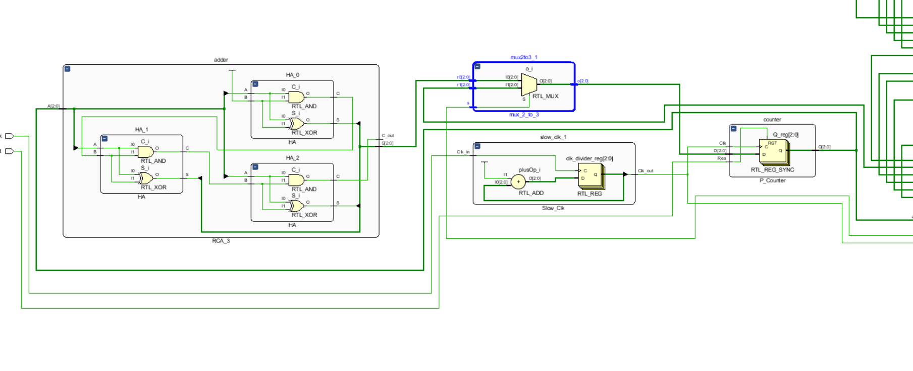

# Nano Processor Design

## Overview

This repository contains the VHDL code for a Nano Processor implemented in Vivado. The processor includes multiplexers, adders, address decoders, instruction decoders, and various other components. The project was demonstrated using Digilent Basys 3 FPGA development board. It is capable of decoding basic machine code programs and executing them. 

## MicroProcessor Operation Instructions

### Mapping

- **Reset Button** - U18
- **LED Signals**:
  - Register 7 - U16, E19, U19, V19
  - Zero - P1
  - Overflow - L1
- **7-Segment Display** - W4

### Behavior

1. After powering up, the board should display the digits 0, 3, 5, 6 in-order on both the 7-segment display and LEDs.
2. The final result of the program (6) should be displayed at the end, which is the sum of all integers between 1 and 3.
3. It is normal to observe the zero and overflow indicators light up during operation.
4. If the reset button is pressed for at least one slow clock cycle, the program restarts.

## Sample Program

Assembly code of the sample program running on the processor to get above results can be found from [here] (https://github.com/RovinKYK/Nano-Processor-Design/blob/main/Assembly%20Code.txt)
